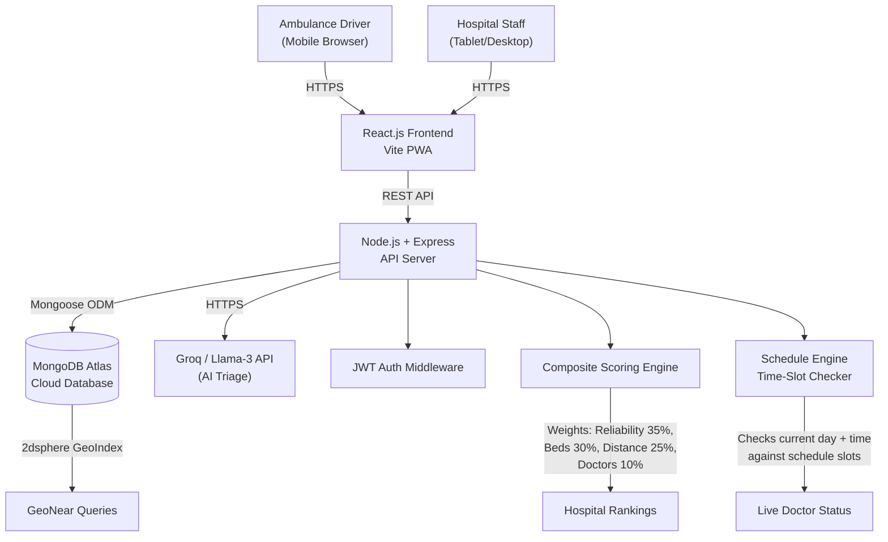
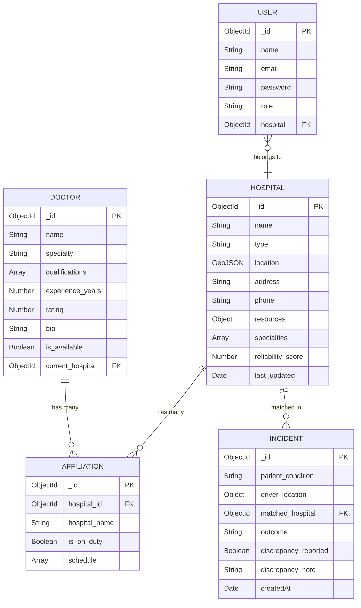

<div align="center">

# 🚑 Golden Hour Navigator

### Real-Time Emergency Hospital & Specialist Routing Platform

**IET TechFest Hackathon 2026 · Problem 10 · Healthcare / Emergency Response**


**Team CodeCrafters** · Lead: Saqib Ayaz · Members: Toheed Ahmed, Sameer Ahmed

### 🚀 **Live Demo:** [http://golden-hour-nav.duckdns.org](http://golden-hour-nav.duckdns.org)

</div>

---

## The Problem

Every minute of delay in emergency care costs lives. Yet today:

- Ambulance drivers arrive at hospitals **without knowing** if beds, oxygen, or a matching specialist are actually available
- Hospitals hide their true capacity to **protect budget allocations**
- Doctors with **dual practices** claim availability at two hospitals simultaneously — a lie the system cannot detect
- Families and drivers make routing decisions based on **personal contacts and guesswork**, not data

> *"The moment of decision is very short. A driver usually has a patient in the back and a phone that may or may not have signal."*
> — IET TechFest Problem Statement 10

---

## Our Solution

**Golden Hour Navigator** is a **unified, transparent web platform** that interlinks all hospitals and doctors in a region into a single real-time system.

| User | What They Can Do |
|------|-----------------|
| **Ambulance Driver** | Search for the nearest capable hospital or specialist in seconds |
| **Hospital Staff** | Update live resource status (beds, oxygen, medicines) in one tap |
| **Doctors** | Declare their schedule per hospital — system detects if they are physically present during claimed slots |
| **Administrators** | Monitor reliability scores, discrepancy reports, and system-wide analytics |

---

## Key Features

### AI Triage Assistant (Powered by Groq / Llama-3)
- **Floating AI Chatbot** available to drivers en route to the hospital.
- **🎙️ Voice Commands:** Drivers can tap the microphone icon to speak their symptoms hands-free while driving.
- Grok AI instantly returns **actionable first-aid protocols** (e.g., CPR instructions, burn care) to stabilize the patient during the "Golden Hour".
- **Backend API Proxy:** Calls to `api.x.ai/v1/chat/completions` are securely routed through our Express backend.
- **Fail-Safe Simulation:** If the API key is missing or rate-limited, the system gracefully falls back to a locally simulated triage engine with 100% realistic UI.

### Hospital Search (2 modes)
| Mode | How It Works |
|------|-------------|
| **Nearest** | `$geoNear` MongoDB query finds the closest hospital with available beds + required speciality |
| **Best Match** | Composite scoring algorithm ranks hospitals by Reliability (35%) + Beds (30%) + Distance (25%) + Live Doctors (10%) |

### ⏳ The "Golden Hour" Countdown Timer
- When a driver begins a hospital route, a **live 60-minute countdown** begins on screen.
- Visually pulses red when critical time (under 15 mins) is remaining, reinforcing the core "Golden Hour" theme of the hackathon.

### Doctor Search
- Filter by **specialization** (Cardiac, Trauma, Burns, Maternity, Neurology, General)
- Each doctor shows a **per-hospital schedule** (day + time slots, e.g. Mon–Thu 9am–2pm at Jinnah, Tue–Thu 4pm–8pm at Private Clinic)
- **"Available Now" toggle** — only shows doctors whose schedule slot is active *right now*
- Automatically **detects dual-practice fraud** — if a doctor is marked on duty at two hospitals simultaneously, the conflict is flagged

### Truth Engine
- Every time a driver is **turned away** at a hospital shown as "available", the hospital's **Reliability Score drops by 5 points**
- Successful admissions **add 1 point**
- Hospitals with high reliability are ranked higher in recommendations — giving them an incentive to report accurately
- **Anonymous Whistleblower** — staff can report discrepancies without exposing their identity

### Offline Mode & Remote Operations
- **Browser Caching:** Last search results are cached in `localStorage`.
- **Manual City Override:** If GPS is unavailable, drivers can manually select their city (e.g., Sukkur, Khairpur, Gambat) to instantly mock coordinates and find local facilities.
- **PWA-Ready:** Prepared with `manifest.json` for home-screen installation.

---

## System Architecture



---

## Database ER Diagram



---

## Project Structure

```
golden-hour-navigator/
│
├── backend/                        # Node.js + Express API
│   ├── config/
│   │   └── db.js                   # MongoDB Atlas connection
│   ├── middleware/
│   │   └── auth.js                 # JWT authentication guard
│   ├── models/
│   │   ├── Hospital.js             # GeoJSON + resources + reliability_score
│   │   ├── Doctor.js               # Multi-hospital schedules (day+time slots)
│   │   ├── Incident.js             # Search logs + outcome tracking
│   │   └── User.js                 # bcrypt-hashed staff accounts
│   ├── routes/
│   │   ├── hospitalRoutes.js       # /search /recommend /stats /resources
│   │   ├── doctorRoutes.js         # /search (proximity + schedule aware)
│   │   ├── incidentRoutes.js       # /outcome /whistleblow
│   │   └── authRoutes.js           # /login /register
│   ├── seed.js                     # Demo: 6 hospitals, 7 doctors, schedules
│   └── server.js                   # Express entry point
│
└── frontend/                       # React + Vite PWA
    └── src/
        ├── components/
        │   ├── Navbar.jsx           # Sticky nav with auth-aware links
        │   ├── HospitalCard.jsx     # Status, ETA, reliability ring, actions
        │   ├── DoctorCard.jsx       # Schedule rows, live slot detection
        │   ├── MapView.jsx          # Leaflet dark map with markers
        │   └── ReliabilityRing.jsx  # SVG circular progress ring
        ├── pages/
        │   ├── DriverPage.jsx       # Dual-tab: Hospital Search + Doctor Search
        │   ├── HospitalDashboard.jsx# Resource status + doctor duty management
        │   ├── HospitalsPage.jsx    # Searchable hospital directory
        │   ├── DoctorsPage.jsx      # Specialty-filtered doctor directory
        │   └── LoginPage.jsx        # JWT hospital staff login
        ├── context/
        │   └── AuthContext.jsx      # JWT state management
        └── services/
            └── api.js              # All Axios calls to backend
```

---

## Tech Stack

| Layer | Technology | Why |
|-------|-----------|-----|
| Frontend | React 18 + Vite | Fast builds, PWA-ready, component model |
| Styling | Vanilla CSS + CSS Variables | Zero dependencies, full design control |
| Maps | Leaflet + react-leaflet | Lightweight, open-source, dark tiles |
| Icons | Lucide React | Consistent, lightweight icon set |
| Backend | Node.js + Express.js | High concurrency, non-blocking I/O |
| Database | MongoDB Atlas | GeoJSON native, flexible schema, cloud |
| ODM | Mongoose | Schema validation, pre-save hooks |
| Auth | JWT + bcryptjs | Stateless, scalable |
| Geo Queries | MongoDB `$geoNear` + `2dsphere` | Native geospatial indexing |
| Toast | react-hot-toast | Lightweight notification system |

---

## API Reference

### Hospitals
| Method | Endpoint | Description |
|--------|----------|-------------|
| `GET` | `/api/hospitals/search?lat&lng&condition` | Nearest hospitals with required speciality |
| `GET` | `/api/hospitals/recommend?lat&lng&condition` | Composite-scored best-match recommendations |
| `GET` | `/api/hospitals/stats` | System-wide analytics snapshot |
| `GET` | `/api/hospitals` | All hospitals sorted by reliability |
| `PUT` | `/api/hospitals/:id/resources` | Live resource update (beds, oxygen, medicines) |

### Doctors
| Method | Endpoint | Description |
|--------|----------|-------------|
| `GET` | `/api/doctors/search?lat&lng&specialty&available_now` | Proximity + schedule-aware doctor search |
| `GET` | `/api/doctors` | All doctors with affiliations |
| `PUT` | `/api/doctors/:id/schedule` | Update on-duty status and current hospital |

### Incidents
| Method | Endpoint | Description |
|--------|----------|-------------|
| `POST` | `/api/incidents` | Log a new search event |
| `PUT` | `/api/incidents/:id/outcome` | Report admitted / turned away (adjusts reliability) |
| `POST` | `/api/incidents/:id/whistleblow` | Anonymous staff discrepancy report |

### Auth
| Method | Endpoint | Description |
|--------|----------|-------------|
| `POST` | `/api/auth/login` | Login → returns JWT |
| `POST` | `/api/auth/register` | Register new hospital staff |

---

## Composite Scoring Algorithm

When using "Best Match" mode, each hospital is scored as:

```
Score = (Reliability × 0.35) + (Beds × 0.30) + (Distance × 0.25) + (Doctors × 0.10)

Where:
  Reliability = hospital.reliability_score (0–100)
  Beds        = 100 if green, 60 if yellow, 0 if red
  Distance    = max(0, 100 − (km / 50) × 100)
  Doctors     = min(100, live_doctor_count × 25)
```

---

## Getting Started

### Prerequisites
- Node.js v18+
- MongoDB Atlas account (free tier works)

### 1. Clone & Install

```bash
git clone https://github.com/your-team/golden-hour-navigator.git
cd golden-hour-navigator
npm run install-all
```

### 2. Configure Environment

Edit `backend/.env`:
```env
MONGO_URI=mongodb+srv://<user>:<pass>@cluster.mongodb.net/golden-hour-navigator
PORT=5000
JWT_SECRET=your_secret_here
```

### 3. Seed Demo Data

```bash
cd backend && npm run seed
```

Creates 6 hospitals, 7 doctors with schedules, and 3 user accounts.

### 4. Run

```bash
# From root directory — runs both backend and frontend concurrently
npm run dev
```

| Service | URL |
|---------|-----|
| Frontend | http://localhost:3000 |
| Backend API | http://localhost:5000 |

### Demo Accounts (For Judges)

| Facility | Email | Password | Role |
|----------|-------|----------|------|
| Civil Hospital Sukkur | `staff@civil.com` | `password123` | Hospital Staff |
| Hira Medical Center | `staff@hira.com` | `password123` | Hospital Staff |
| Red Crescent Hospital | `staff@redcrescent.com` | `password123` | Hospital Staff |

---

## Problem → Solution Mapping

| Problem from Brief | Our Solution |
|-------------------|-------------|
| Driver doesn't know which hospital has capacity | Real-time `$geoNear` search with live bed/oxygen status |
| Hospitals hide true capacity | Reliability Score drops when drivers are turned away |
| Doctors claim availability at two hospitals | Schedule system detects conflicts; admins see live duty flags |
| Private hospitals accept for insurance, not capability | Composite scoring de-ranks hospitals that turn drivers away |
| No signal / rural areas | PWA + localStorage cache shows last known data offline |
| Staff can't report problems safely | Anonymous whistleblower modal — no identity stored |

---

<div align="center">

**Built with purpose at IET TechFest Hackathon 2026**

*Every second matters. This platform gives those seconds back.*

</div>
